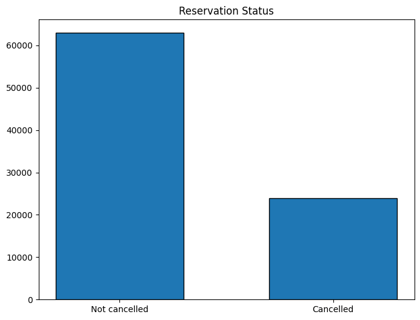
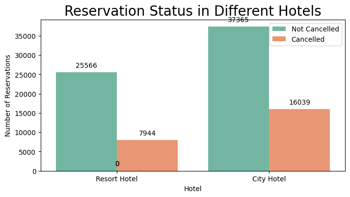
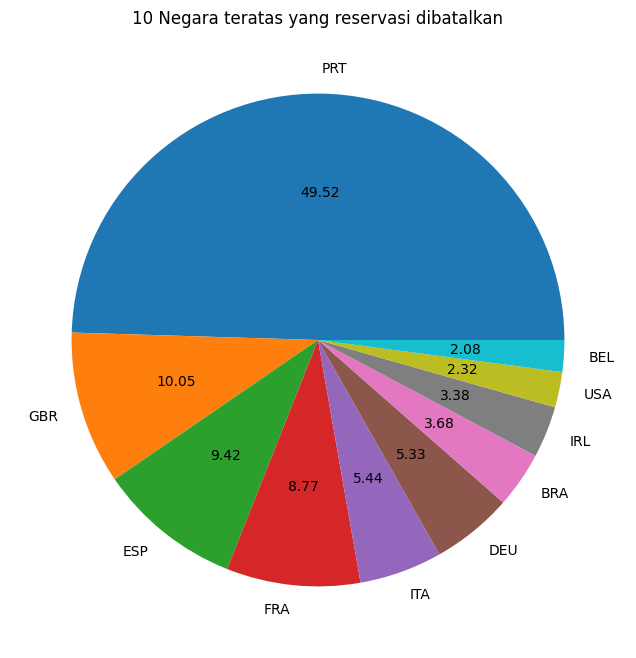
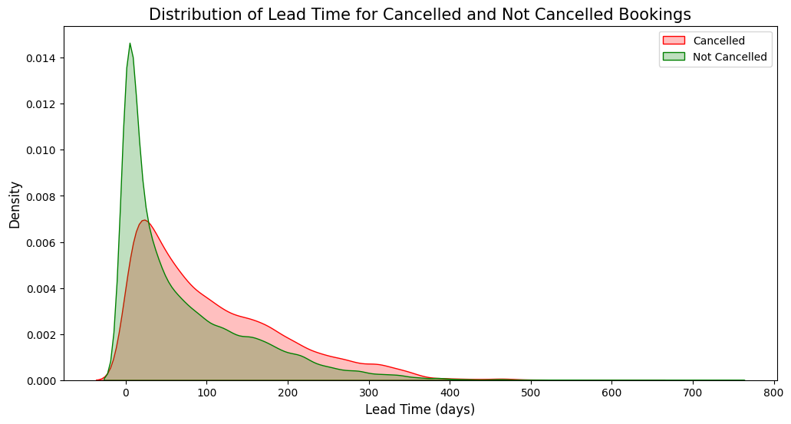
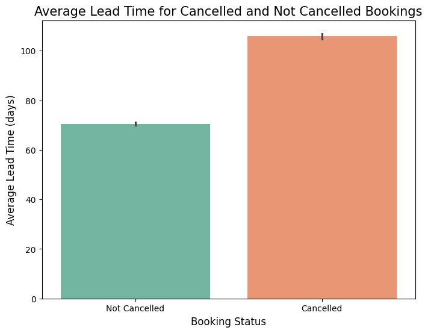
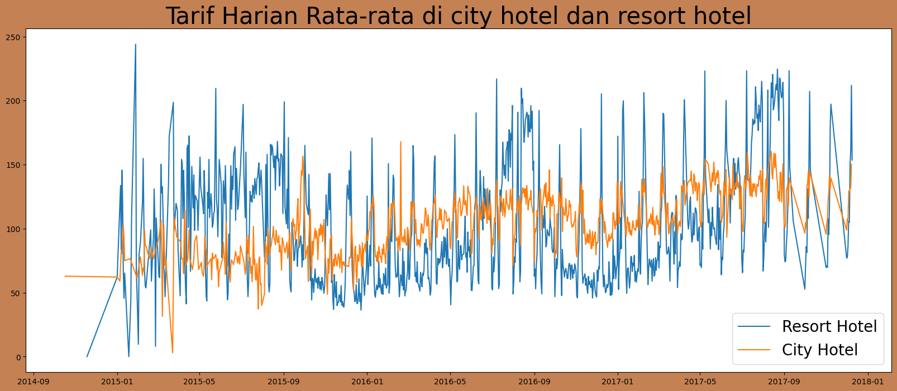
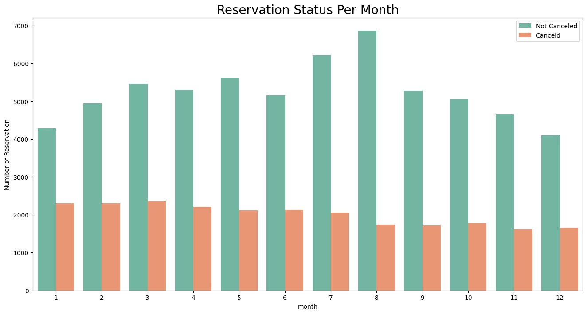
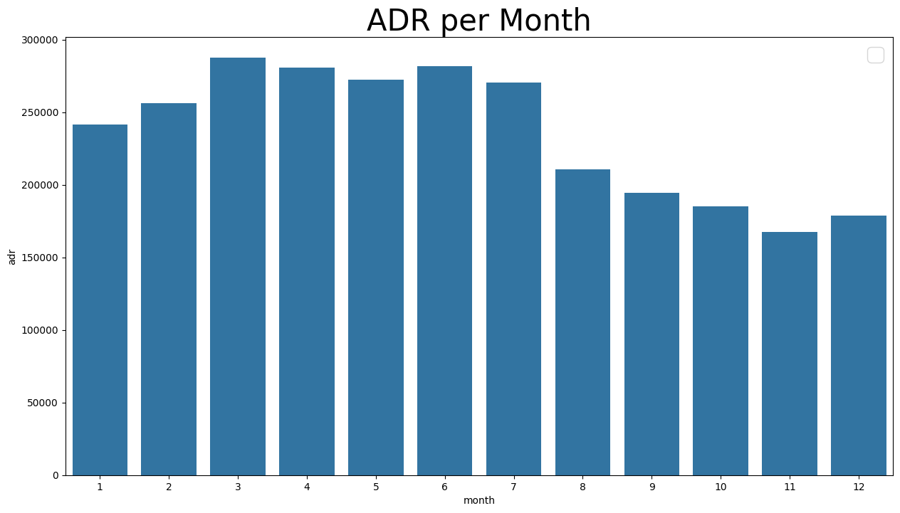

<!-- HEADER -->
<p align='center'>
<a href="#" align='center'>
    
  </a>
<p/>

<p align="center">
  <h3 align="center">
    Learn More About Analysis Big Data
  </h3>
  <br/>
</p>

## Team group

<div>
Analisis Big Data B

- Naza Nadhana Afdha (202110370311522)
- Yashinta Indrastuti (202110370311502)

Notebook Link : <a href="https://colab.research.google.com/drive/1Ze0T30SshZx5_zf-S51gENACClA6OnlV?usp=sharing">Click Here</a>

</div>

<!--Daftar Isi-->

## Daftar Isi

- [Pendahuluan](#pendahuluan)
- [Package yang Diperlukan](#package-yang-diperlukan)
- [Data Preparation](#data-preparation)
- [Eksplorasi dan Analisa Data](#eksplorasi-dan-analisa-data)
- [Kesimpulan](#kesimpulan)
  <br><br>

<!--PENDAHULUAN-->

## Pendahuluan

<div align='justify'>
Dataset "Hotel Booking" yang digunakan dalam analysis ini yang dimiliki oleh <a href='https://github.com/rfordatascience/tidytuesday/blob/main/data/2020/2020-02-11/readme.md'>TidyTuesday</a> mencakup data pemesanan hotel dari dua jenis hotel: City Hotel dan Resort Hotel. Dataset ini berisi berbagai variabel terkait pemesanan, seperti is_canceled, lead_time, adr (Average Daily Rate), customer_type, dan special_requests. Data ini merepresentasikan pola perilaku pelanggan dalam melakukan reservasi hotel, termasuk faktor-faktor yang memengaruhi pembatalan pesanan. Dengan total puluhan variabel, dataset ini menjadi peluang menarik bagi para analis data untuk memahami karakteristik pemesanan di industri perhotelan.
<br>

Namun, data yang kompleks memberikan tantangan tersendiri bagi para analis. Beberapa variabel memiliki distribusi yang tidak merata atau mengandung outlier, sehingga menyulitkan untuk mengidentifikasi pola dengan jelas. Selain itu, adanya nilai yang hilang atau variabel yang tidak relevan dapat memengaruhi keakuratan analisis dan interpretasi.
<br>

Untuk mengatasi tantangan ini, kami menggunakan teknik pembersihan data, eksplorasi statistik deskriptif, dan visualisasi data untuk mengidentifikasi faktor-faktor utama yang memengaruhi pembatalan pemesanan. Tujuan dari penelitian ini adalah memberikan pemahaman yang lebih baik tentang pola pemesanan hotel, sehingga manajemen hotel dapat mengambil keputusan yang lebih baik untuk mengurangi tingkat pembatalan dan meningkatkan efisiensi operasional. Penelitian ini diharapkan dapat memberikan wawasan strategis bagi industri perhotelan dalam menghadapi tantangan pembatalan pesanan.
<br>

### 1.1 Rumusan Masalah

Berdasarkan latar belakang yang telah ditulis di atas, maka rumusan masalah yang dapat difokuskan pada penelitian ini yaitu:

1. Faktor apa saja yang memengaruhi pembatalan pemesanan hotel, dan bagaimana pola hubungan antar faktor tersebut?
2. Apakah terdapat perbedaan pola pembatalan pemesanan antara jenis hotel yang berbeda, seperti City Hotel dan Resort Hotel?
3. Bagaimana wawasan dari analisis ini dapat digunakan untuk mengurangi tingkat pembatalan pesanan dan meningkatkan efisiensi operasional hotel?

### 1.2 Solusi Mengatasi Masalah

Untuk mengatasi masalah ini, kami akan menggunakan data historis yang berisi informasi tentang reservasi hotel, termasuk status pembatalan, rincian pelanggan, dan parameter reservasi lainnya. Rencana kami mencakup:

1. Membersihkan data untuk memastikan kualitas analisis.
2. Mengeksplorasi pola pembatalan.
3. Mengidentifikasi variabel-variabel kunci yang memengaruhi pembatalan pesanan.

### 1.3 Teknik Analisis yang digunakan

Dalam memberikan solusi, kami menggunakan teknik analisis berikut :

1. Data cleaning serta summary awal untuk mengetahui isi data.
2. Statistik deskriptif untuk mengidentifikasi tren.
3. Visualisasi data berupa histogram dan scatterplot untuk hubungan antar variabel.

### 1.4 Manfaat Analisis

Analysis ini diharapkan dapat memberikan manfaat sebagai berikut :

1. Menerapkan kebijakan pemesanan yang lebih efektif, seperti memberikan insentif untuk mengurangi pembatalan.
2. Mengoptimalkan strategi pemasaran dengan menargetkan kelompok pelanggan yang lebih cenderung menyelesaikan reservasi.
3. Meningkatkan pengalaman pelanggan dengan memahami kebutuhan mereka, sehingga dapat mengurangi pembatalan akibat ketidakpuasan.

</div>
<br>

<!--PACKAGE YANG DIPERLUKAN-->

## Package yang Diperlukan

<div align='justify'>

### 2.1 Colab atau Python

Pada Analysis ini, program dijalankan pada platfrom Google colab, namun jika ingin dijalankan IDE masing-masing, anda bisa menginstall python versi 3.12. Untuk mempelajarinya lebih lanjut, dapat menekan <a href="https://www.python.org/downloads/release/python-3100/">disini</a>.

Selanjutnya, instalasi beberapa library pyton juga diperlukan. Jika anda menjalankan di IDE masing-masing, anda dapat melakukan instalasi library pada terminal python menggunakan `pip`. Tiap library ini yaitu sebagai berikut :

\*Pandas - Latest <br>

```sh
pip install pandas
```

\*Numpy - Latest <br>

```sh
pip install numpy
```

\*Matplotlib - Latest <br>

```sh
pip install matplotlib
```

\*Seaborn - Latest <br>

```sh
pip install seaborn
```

### 2.2 Pesan dan Peringatan yang Dihilangkan

Untuk menjaga notebook tetap bersih dari pesan atau peringatan yang tidak diperlukan, perintah berikut digunakan:

```sh
import warnings
warnings.filterwarnings('ignore')
```

</div>
<br>

<!--DATA PREPARATION-->

## Data Preparation

<div align='justify'>

### 3.1 Sumber Data

<p align='center'>
<a href="#" align='center'>
    
  </a>
<p/>

Data dalam penelitian ini bersumber dari Github <a href='https://github.com/rfordatascience/tidytuesday/blob/main/data/2020/2020-02-11/readme.md'>TidyTuesday</a>. Dataset ini dapat dikunjungi dengan menekan hyperlink diatas.

### 3.2 Spesifikasi Data

- Tujuan Awal Data : Data ini dikhususkan untuk analisis pemesanan hotel. Data ini dikumpulkan pada `11 Februari 2020` oleh tidytuesday.

- Jumlah Variabel : Dataset ini mencakup 32 variabel. Dictionary data ini adalah sebagai berikut.

| variable                       | class     | description                                                                                                                                                                                                                                                                                                                                                                                                                                |
| :----------------------------- | :-------- | :----------------------------------------------------------------------------------------------------------------------------------------------------------------------------------------------------------------------------------------------------------------------------------------------------------------------------------------------------------------------------------------------------------------------------------------- |
| hotel                          | character | Hotel (H1 = Resort Hotel atau H2 = City Hotel)                                                                                                                                                                                                                                                                                                                                                                                             |
| is_canceled                    | double    | Nilai yang menunjukkan apakah pemesanan dibatalkan (1) atau tidak (0)                                                                                                                                                                                                                                                                                                                                                                      |
| lead_time                      | double    | Jumlah hari yang berlalu antara tanggal masuk pemesanan ke dalam PMS dan tanggal kedatangan                                                                                                                                                                                                                                                                                                                                                |
| arrival_date_year              | double    | Tahun dari tanggal kedatangan                                                                                                                                                                                                                                                                                                                                                                                                              |
| arrival_date_month             | character | Bulan dari tanggal kedatangan                                                                                                                                                                                                                                                                                                                                                                                                              |
| arrival_date_week_number       | double    | Nomor minggu dalam tahun untuk tanggal kedatangan                                                                                                                                                                                                                                                                                                                                                                                          |
| arrival_date_day_of_month      | double    | Hari dalam bulan dari tanggal kedatangan                                                                                                                                                                                                                                                                                                                                                                                                   |
| stays_in_weekend_nights        | double    | Jumlah malam akhir pekan (Sabtu atau Minggu) tamu menginap atau memesan untuk menginap di hotel                                                                                                                                                                                                                                                                                                                                            |
| stays_in_week_nights           | double    | Jumlah malam hari kerja (Senin hingga Jumat) tamu menginap atau memesan untuk menginap di hotel                                                                                                                                                                                                                                                                                                                                            |
| adults                         | double    | Jumlah dewasa                                                                                                                                                                                                                                                                                                                                                                                                                              |
| children                       | double    | Jumlah anak-anak                                                                                                                                                                                                                                                                                                                                                                                                                           |
| babies                         | double    | Jumlah bayi                                                                                                                                                                                                                                                                                                                                                                                                                                |
| meal                           | character | Jenis makanan yang dipesan. Kategori disajikan dalam paket makanan standar perhotelan: <br> Undefined/SC – tidak ada paket makanan; <br> BB – Bed & Breakfast; <br> HB – Half board (sarapan dan satu makanan lainnya – biasanya makan malam); <br> FB – Full board (sarapan, makan siang, dan makan malam)                                                                                                                                |
| country                        | character | Negara asal. Kategori direpresentasikan dalam format ISO 3155–3:2013                                                                                                                                                                                                                                                                                                                                                                       |
| market_segment                 | character | Penunjukan segmen pasar. Dalam kategori, istilah "TA" berarti "Travel Agents" dan "TO" berarti "Tour Operators"                                                                                                                                                                                                                                                                                                                            |
| distribution_channel           | character | Saluran distribusi pemesanan. Istilah "TA" berarti "Travel Agents" dan "TO" berarti "Tour Operators"                                                                                                                                                                                                                                                                                                                                       |
| is_repeated_guest              | double    | Nilai yang menunjukkan apakah nama pemesanan berasal dari tamu yang sudah pernah menginap sebelumnya (1) atau tidak (0)                                                                                                                                                                                                                                                                                                                    |
| previous_cancellations         | double    | Jumlah pemesanan sebelumnya yang dibatalkan oleh pelanggan sebelum pemesanan saat ini                                                                                                                                                                                                                                                                                                                                                      |
| previous_bookings_not_canceled | double    | Jumlah pemesanan sebelumnya yang tidak dibatalkan oleh pelanggan sebelum pemesanan saat ini                                                                                                                                                                                                                                                                                                                                                |
| reserved_room_type             | character | Kode tipe kamar yang dipesan. Kode disajikan untuk menjaga anonimitas                                                                                                                                                                                                                                                                                                                                                                      |
| assigned_room_type             | character | Kode tipe kamar yang diberikan pada pemesanan. Kadang-kadang tipe kamar yang diberikan berbeda dari tipe kamar yang dipesan karena alasan operasional hotel (misalnya overbooking) atau atas permintaan pelanggan. Kode disajikan untuk menjaga anonimitas                                                                                                                                                                                 |
| booking_changes                | double    | Jumlah perubahan/amendemen yang dilakukan pada pemesanan dari saat pemesanan dimasukkan ke PMS hingga saat check-in atau pembatalan                                                                                                                                                                                                                                                                                                        |
| deposit_type                   | character | Indikasi apakah pelanggan membuat deposit untuk menjamin pemesanan. Variabel ini memiliki tiga kategori: <br>No Deposit – tidak ada deposit yang dibuat; <br>Non Refund – deposit dibuat sebesar total biaya menginap; <br>Refundable – deposit dibuat dengan nilai di bawah total biaya menginap                                                                                                                                          |
| agent                          | character | ID agen perjalanan yang membuat pemesanan                                                                                                                                                                                                                                                                                                                                                                                                  |
| company                        | character | ID perusahaan/entitas yang membuat pemesanan atau bertanggung jawab untuk membayar pemesanan. ID disajikan untuk menjaga anonimitas                                                                                                                                                                                                                                                                                                        |
| days_in_waiting_list           | double    | Jumlah hari pemesanan dalam daftar tunggu sebelum dikonfirmasi ke pelanggan                                                                                                                                                                                                                                                                                                                                                                |
| customer_type                  | character | Jenis pemesanan, dengan empat kategori: <br>Contract - ketika pemesanan memiliki alokasi atau jenis kontrak lain yang terkait; <br>Group – ketika pemesanan terkait dengan grup; <br>Transient – ketika pemesanan tidak termasuk dalam grup atau kontrak, dan tidak terkait dengan pemesanan transient lainnya; <br>Transient-party – ketika pemesanan adalah transient, tetapi terkait dengan setidaknya satu pemesanan transient lainnya |
| adr                            | double    | Rata-rata tarif harian yang dihitung dengan membagi jumlah total transaksi penginapan dengan total jumlah malam menginap                                                                                                                                                                                                                                                                                                                   |
| required_car_parking_spaces    | double    | Jumlah ruang parkir mobil yang dibutuhkan oleh pelanggan                                                                                                                                                                                                                                                                                                                                                                                   |
| total_of_special_requests      | double    | Jumlah permintaan khusus yang dibuat oleh pelanggan (misalnya tempat tidur kembar atau lantai tinggi)                                                                                                                                                                                                                                                                                                                                      |
| reservation_status             | character | Status terakhir reservasi, dengan tiga kategori: <br>Canceled – pemesanan dibatalkan oleh pelanggan; <br>Check-Out – pelanggan telah check-in tetapi sudah berangkat; <br>No-Show – pelanggan tidak melakukan check-in dan tidak memberi tahu hotel alasannya                                                                                                                                                                              |
| reservation_status_date        | double    | Tanggal ketika status terakhir ditetapkan. Variabel ini dapat digunakan bersama dengan ReservationStatus untuk memahami kapan pemesanan dibatalkan atau kapan pelanggan check-out dari hotel                                                                                                                                                                                                                                               |

### 3.3 Data Cleaning

Pertama data di load menggunakan library pandas `pandas.read_csv` untuk membaca file csv dari data Hotel booking.

Teknik data cleaning yang diterapkan adalah sebagai berikut.

- Pemeriksaan data duplikat : Hal ini bermanfaat untuk memastikan tidak ada data sama yang dapat mempengaruhi hasil analisa baik secara deskriptif maupun visualisasi.
- Pemeriksaan data null : Hal ini bermanfaat untuk menghilangkan data rancu karena value yang kosong. Jika ditemukan data yang memiliki kolum `null`, maka data tersebut akan dihapus.
- Perbaikan format tanggal : Hal ini untuk mengubah format tanggal yang salah agar sesuai dengan format yang sesuai, seperti pada variabel `reservation_status_date` yang memiliki format tanggal yang salah.

### 3.4 Data Cleaned Information

Setelah melakukan proses data cleaning, data yang siap untuk dianalisis memiliki karakteristik sebagai berikut:

Jumlah Data (Count):

- Terdapat 32,830 pemesanan hotel yang dianalisis setelah proses pembersihan.
- Tidak ada data yang hilang karena seluruh nilai yang hilang telah dihapus atau diimputasi.
- Variabel yang tidak relevan seperti agent dan company telah dihapus untuk meningkatkan efisiensi analisis.

Lead Time:

- Mean: 104.01 menunjukkan rata-rata waktu antara pemesanan dan kedatangan cukup panjang (dalam hari).
- Std: 106.68 menunjukkan variasi yang signifikan dalam lead time.
- Min-Max: 0 - 737 hari, menunjukkan pemesanan dilakukan baik mendekati waktu kedatangan maupun jauh sebelumnya.
- Median: 69 hari, menunjukkan distribusi sedikit miring ke kanan karena adanya lead time yang sangat panjang.

Average Daily Rate (ADR):

- Mean: 101.83, menunjukkan rata-rata harga harian pemesanan.
- Std: 50.54, menunjukkan variasi harga yang cukup besar.
- Min-Max: 0.0 - 5400.0, menunjukkan rentang harga dari sangat murah hingga sangat mahal.
- Median: 94.58, mendekati mean, menunjukkan distribusi relatif simetris dengan beberapa outlier ekstrem.

Special Requests:

- Mean: 0.57 menunjukkan rata-rata jumlah permintaan khusus tamu relatif rendah.
- Std: 0.79 menunjukkan variasi jumlah permintaan cukup kecil.
- Min-Max: 0 - 5, menunjukkan rentang dari tidak ada hingga lima permintaan khusus.

Distribusi Data:

- Lead Time: Mayoritas pesanan memiliki lead time di bawah 200 hari, tetapi ada beberapa yang sangat panjang (outlier).
- ADR: Sebagian besar harga berada di kisaran rendah hingga sedang, dengan beberapa outlier yang sangat mahal.
- Special Requests: Mayoritas pesanan memiliki kurang dari dua permintaan khusus.

Insight Penting:

1. Rata-rata lead time yang cukup panjang (104 hari) menunjukkan bahwa sebagian besar tamu memesan jauh sebelumnya, tetapi outlier dengan lead time sangat panjang memerlukan perhatian khusus.
2. Harga harian rata-rata yang cukup tinggi dengan outlier ekstrem dapat menunjukkan perbedaan antara City Hotel dan Resort Hotel.
3. Sebagian besar tamu memiliki sedikit atau tanpa permintaan khusus, tetapi tamu dengan permintaan khusus mungkin lebih kecil kemungkinan untuk membatalkan.

</div>
<br>

<!--EKSPLORASI DAN ANALISA DATA-->

## Eksplorasi Analisis Data dan visualisasi

Storyboard: Menjelajahi Tren Pembatalan Pemesanan Hotel

Hotel merupakan bagian penting dari industri pariwisata dan perjalanan. Dengan jutaan reservasi hotel yang terjadi setiap tahun, dan pada data ini memberikan wawasan untuk memahami pola pemesanan dan pembatalan hotel di seluruh dunia.
Melalui berbagai sumber data, termasuk sistem reservasi hotel dan laporan pelanggan, kita dapat menganalisis tren yang menyebabkan pembatalan pemesanan.
Dataset ini menyajikan informasi mendetail mengenai faktor-faktor seperti waktu pemesanan, segmen pelanggan, jenis deposit, dan kebiasaan pelanggan.
Dengan mengeksplorasi data ini, kita akan menemukan pola serta faktor utama yang memengaruhi keputusan pelanggan untuk membatalkan pesanan hotel.

Berikut hasil analisis:

### - Total pesanan yang dibatalkan

<p align='center'>
<a href="#" align='center'>
    
  </a>
<p/>

Pada grafik di atas didapat dari total pemesanan bahwa sebanyak 62931 pemesanan yang diterima dan 23983 pemesanan yang dibatalkan,
sehingga tercatat sebanyak 37% klien yang membatalkan pemesanan hotel tersebut dari total seluruh data yang ada

### - Perbandingan jumlah pesanan yang diterima dan dibatalkan antara City Hotel dan Resort Hotel.

<p align='center'>
<a href="#" align='center'>
    
  </a>
<p/>

Pada hasil perbandingan tipe hotel di atas, didapat bahwa City Hotel memiliki lebih banyak pemesanan serta pembatalan pemesanan yang lebih tinggi,
hal ini Mungkin karena Hotel Resort lebih mahal daripada Hotel City.

### - Daftar 10 negara teratas dengan tingkat pembatalan pemesanan tertinggi.

<p align='center'>
<a href="#" align='center'>
    
  </a>
<p/>

dilihat dari visualisasi di atas didapat bahwa:

Portugal, Portugal memiliki jumlah terbanyak yang terjadi pembatalan pemesanan yaitu 49.52% dari total 10 negara teratas
United Kingdom of Great Britain and Northern Ireland, kedua terjadi pada negara United Kingdom yang terjadi pembatalan pemesanan yaitu 10.05% dari total 10 negara teratas
Spanyol, ketika terjadi pada negara spanyol yang terjadi pembatalan pemesanan yaitu 9.42% dari total 10 negara teratas
Francis, diikuti perancis yang terjadi pembatalan pemesanan yaitu 8.77% dari total 10 negara teratas

### - Hubungan antara lead time dan tingkat pembatalan pemesanan.

<p align='center'>
<a href="#" align='center'>
    
  </a>
<p/>

Dilihat dari data dan visulisasi di atas menunjukkan:

Booking dengan lead time lebih panjang cenderung memiliki peluang lebih besar untuk dibatalkan dan Booking dengan lead time pendek memiliki kemungkinan lebih kecil untuk dibatalkan.
dan Ini terlihat dari rata-rata lead time lebih tinggi pada pemesanan yang dibatalkan (105.82 hari) dibandingkan dengan yang tidak dibatalkan (70.44 hari)

### - Perbandingan tarif harian rata-rata (ADR) antara City Hotel dan Resort Hotel.

<p align='center'>
<a href="#" align='center'>
    
  </a>
<p/>

Pada Grafik garis di atas menunjukkan bahwa pada hari-hari tertentu, tarif harian rata-rata untuk city hotel lebih rendah daripada tarif harian Resort hotel, serta juga ada tarif hariannya bahkan lebih rendah lagi.
Ini memungkinkah bahwa pada akhir pekan dan hari libur, tarif Resort hotel akan naik.

### - Distribusi status reservasi pada setiap bulan serta pola pembatalan pemesanan berdasarkan bulan.

<p align='center'>
<a href="#" align='center'>
    
  </a>
<p/>

Pada diagram yang dikelompokkan berdasarkan bulan dengan tingkat reservasi tertinggi dan terendah berdasarkan statusnya. terlihat bahwa bulan Agustus paling tinggi, dengan jumlah reservasi diterima tertinggi dan pembatalan relatif sedikit.
Sebaliknya, Januari memiliki reservasi diterima paling sedikit tetapi jumlah reservasi yang dibatalkan tertinggi.

### - Analisis pendapatan rata-rata per hari (ADR) berdasarkan bulan.

<p align='center'>
<a href="#" align='center'>
    
  </a>
<p/>

Pada grafik di atas menggambarkan bahwa pembatalan paling sering terjadi saat harga sedang tinggi dan paling jarang terjadi saat harga sedang rendah.
Akibatnya, harga akomodasi tampaknya menjadi faktor utama yang memengaruhi pembatalan.

### - Pengaruh reservation status date terhadap tingkat pembatalan pemesanan.

<p align='center'>
<a href="#" align='center'>
    
  </a>
<p/>

Seperti yang terlihat pada grafik, reservasi dibatalkan ketika harga harian rata-rata lebih tinggi daripada ketika reservasi tidak dibatalkan.
Dengan ini membuktikan semua analisis di atas bahwa harga yang lebih tinggi menyebabkan pembatalan pemesanan yang lebih tinggi juga.

</div>
<br>

<!--KESIMPULAN-->

## Kesimpulan

<div align='justify'>

### 5.1 Pernyataan Masalah yang Dibahas

Masalah utama yang dibahas adalah tingginya tingkat pembatalan pesanan di industri perhotelan, yang dapat menyebabkan kerugian finansial dan operasional. Analisis ini bertujuan untuk memahami faktor-faktor yang memengaruhi pembatalan sehingga dapat mengurangi risiko pembatalan dan meningkatkan efisiensi.

### 5.2 Metodologi yang Digunakan

- Data: Dataset historis tentang pemesanan hotel, termasuk status pembatalan dan parameter lain seperti waktu pemesanan, tipe pelanggan, dan rata-rata tarif harian.
- Pendekatan:
  -- Pembersihan data untuk mengatasi nilai yang hilang, outlier, dan variabel yang tidak relevan.
  -- Analisis eksploratif menggunakan visualisasi data dan statistik deskriptif.
  -- Pembuatan tabel dan grafik untuk mengidentifikasi pola pembatalan.

### 5.3 Wawasan Menarik yang ditemukan

1. Tipe Pelanggan: Pelanggan grup memiliki kemungkinan pembatalan yang lebih tinggi dibandingkan pelanggan transient.
2. Lead Time: Pemesanan dengan lead time yang panjang lebih berisiko untuk dibatalkan.
3. Harga (ADR): Pesanan dengan harga lebih tinggi lebih cenderung dibatalkan, menunjukkan bahwa pelanggan mungkin sensitif terhadap harga.
4. Jenis hotel: Resort Hotel mengalami tingkat pembatalan yang lebih tinggi dibandingkan dengan hotel kota. Oleh karena itu, Resort Hotel sebaiknya menawarkan diskon harga kamar yang lebih kompetitif pada akhir pekan dan hari libur.
5. Permintaan Khusus: Pesanan dengan lebih banyak permintaan khusus cenderung lebih jarang dibatalkan, menunjukkan keterlibatan pelanggan yang lebih tinggi.
6. Anomali pemesanan: Pada bulan Januari, tingkat pembatalan cenderung meningkat. Hotel dapat meluncurkan promosi pemasaran dengan penawaran menarik di bulan ini untuk meningkatkan pendapatan.

### 5.4 Manfaat analisis

Hasil analisis ini memberikan wawasan strategis yang dapat membantu efisiensi dan kerugian untuk:

- Meningkatkan Kebijakan Pemesanan: Mengurangi pembatalan melalui kebijakan fleksibel atau penalti untuk pelanggan dengan lead time panjang.
- Strategi Harga yang Efektif: Memberikan diskon untuk lead time yang pendek atau menawarkan fleksibilitas lebih untuk harga yang lebih tinggi.
- Fokus pada Pelanggan Grup: Memberikan penawaran atau kontrak yang lebih menarik untuk mengurangi pembatalan dalam kategori ini.
- Meningkatkan Layanan: Memastikan permintaan khusus pelanggan terpenuhi untuk meningkatkan tingkat penyelesaian reservasi.
- Mengatasi Anomali Musiman: Meluncurkan promosi pemasaran yang menarik pada bulan-bulan dengan tingkat pembatalan tinggi, seperti Januari, untuk mengoptimalkan pendapatan selama musim sepi.
- Diskon untuk Resort Hotel: Mengingat bahwa Resort Hotel memiliki tingkat pembatalan yang lebih tinggi dibandingkan City Hotel, diskon harga kamar yang lebih kompetitif pada akhir pekan dan hari libur dapat membantu menarik lebih banyak pelanggan dan mengurangi tingkat pembatalan.

</div>
<br>
